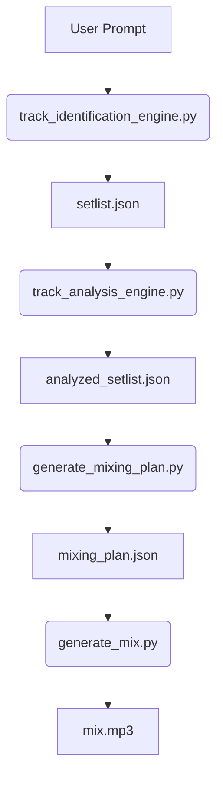

# AI DJ Mixing System

## Overview

The **AI DJ Mixing System** is a fully automated, intelligent DJ pipeline that transforms natural language user prompts into a **professional, seamless, mixed MP3** — complete with beat-matched transitions, harmonic key alignment, tempo adjustments, and context-aware energy flow.

From a single sentence like *"I need a 3-hour casino mix: chill R&B dinner at 8pm, high-energy dancing from 9pm with Bollywood and Afrobeats"*, the system:
1. **Selects** the best-matching songs from your local `./songs` library.
2. **Analyzes** each track for BPM, key, energy, valence, danceability, vocal presence, and structural segments.
3. **Sorts** tracks within time segments for smooth energy progression.
4. **Generates** a detailed **mixing plan** with precise start times, transition types (crossfade, EQ sweep, echo drop, etc.), and tempo correction (OTAC).
5. **Renders** a final `mix.mp3` with **beat-synced, phase-aligned, harmonically compatible transitions**.

The system runs **mostly offline** — only the **initial setlist generation** uses Google Gemini AI. All audio analysis and mixing are performed locally using **Librosa** and **PyDub**.

---

## Key Features

| Feature | Description |
|-------|-----------|
| **Natural Language Input** | Describe your event, time blocks, vibe, and must-play songs. |
| **Smart Track Selection** | Matches songs by genre, energy, and explicit requests. |
| **Advanced Audio Analysis** | Extracts BPM, key, scale, energy, valence, danceability, vocal detection, and beat grid. |
| **Harmonic Mixing** | Ensures key compatibility (same key, ±1 semitone, perfect fifth/fourth). |
| **Tempo Sync (OTAC)** | Calculates logarithmic tempo ramping for smooth BPM transitions. |
| **Beat & Phase Alignment** | Uses onset correlation to align downbeats during transitions. |
| **Multiple Transition Types** | Crossfade, EQ Sweep, Echo Drop, Backspin, Reverb, Loop, Build Drop, and more. |
| **Time-Aware Setlist** | Splits mix into segments (e.g., dinner → dancing) with tailored energy curves. |
| **JSON Planning Outputs** | Full transparency via `setlist.json`, `analyzed_setlist.json`, `mixing_plan.json`. |
| **Final MP3 Export** | Normalized, high-quality mix ready for playback. |

---

## Prerequisites

| Requirement | Details |
|-----------|--------|
| **Python** | `3.8+` |
| **FFmpeg** | Required for PyDub. [Download here](https://ffmpeg.org/download.html) and add to `PATH`. |
| **Google Gemini API Key** | Free tier available at [ai.google.dev](https://ai.google.dev). Add to `.env` as: <br> `GEMINI_API_KEY=your_key_here` |
| **Local MP3 Library** | Place your legally obtained songs in `./songs/`. <br> Supported naming: `Artist - Title.mp3`, `[iSongs.info] 01 - Song.mp3`, etc. |

> **Performance Note**: A 3-hour mix takes ~8–12 minutes on a modern CPU (analysis + rendering).

---

## Installation

```bash
# 1. Clone the repo
git clone https://github.com/yourusername/ai-dj-mixing-system.git
cd ai-dj-mixing-system

# 2. Create virtual environment
python -m venv venv
source venv/bin/activate  # Windows: venv\Scripts\activate

# 3. Install dependencies
pip install -r requirements.txt
```


---

## Usage

### 1. Prepare Your Songs
```bash
./songs/
├── Arijit Singh - Tum Hi Ho.mp3
├── TLC - No Scrubs.mp3
├── Burna Boy - Ye.mp3
└── ...
```

### 2. Run the Pipeline
```bash
python run_pipeline.py
```

> You can **customize the prompt** directly in `run_pipeline.py`:

```python
user_input = (
    "Create a 3-hour mix for a luxury casino. "
    "7–8pm: elegant dinner with chill R&B and Bollywood ballads. "
    "8–9pm: transition to upbeat Afrobeats and danceable R&B. "
    "9–10pm: high-energy dance floor with must-play songs: "
    "[{'title': 'Tum Hi Ho', 'artist': 'Arijit Singh'}, "
    "{'title': 'Ye', 'artist': 'Burna Boy'}]."
)
```

### 3. Output Files

| File | Description |
|------|-------------|
| `setlist.json` | Raw selected tracks per time segment. |
| `analyzed_setlist.json` | Full audio analysis + sorted playback order. |
| `mixing_plan.json` | Professional DJ cue sheet with start times, transitions, OTAC, and comments. |
| `mix.mp3` | Final mixed audio file (normalized, ready to play). |

---

## Pipeline Architecture



### 1. `track_identification_engine.py`
- Uses **Gemini 1.5 Flash** to parse natural language.
- Scans `./songs/` and matches songs by title, artist, and genre.
- Outputs time-segmented `setlist.json`.

### 2. `track_analysis_engine.py`
- Loads MP3s with **Librosa**.
- Extracts:
  - BPM (beat tracking)
  - Key & scale (chroma + correlation)
  - Energy, valence, danceability (via spectral features)
  - Vocal presence (source separation)
  - Structural segments (intro, verse, chorus, etc.)
- Sorts tracks **within each time block** by energy progression.

### 3. `generate_mixing_plan.py`
- Computes **harmonic compatibility** (semitone shifts).
- Calculates **OTAC** (Optimal Tempo Adjustment Coefficient) for smooth BPM ramps.
- Suggests **transition type** based on:
  - BPM difference
  - Key compatibility
  - Vocal overlap
- Outputs `mixing_plan.json` with:
  - Start time (HH:MM:SS)
  - Transition type
  - OTAC value
  - Comment (e.g., "Transition TLC → Burna Boy. Suggested 'EQ Sweep'.")

### 4. `generate_mix.py`
- Applies **real-time audio processing**:
  - Tempo stretching (Librosa `time_stretch`)
  - Beat/phase alignment via **onset correlation**
  - Transition effects:
    - **Crossfade** (default)
    - **EQ Sweep** (high-pass outgoing, low-pass incoming)
    - **Echo Drop**, **Backspin**, **Reverb**, **Loop**, **Build Drop**
- Normalizes and exports `mix.mp3`.

### 5. `run\_pipeline.py`
- Orchestrates all stages.
- Validates file outputs.
- Logs progress with timestamps.

---

## Sample `mixing_plan.json` Output

```json
{
  "mixing_plan": [
    {
      "from_track": null,
      "to_track": "Tum Hi Ho",
      "start_time": "00:00:00",
      "transition_point": "downbeat align",
      "transition_type": "Fade In",
      "otac": 0.0,
      "comment": "Start balanced vibe section."
    },
    {
      "from_track": "Tum Hi Ho",
      "to_track": "No Scrubs",
      "start_time": "00:03:12",
      "transition_point": "beat grid match",
      "transition_type": "Crossfade",
      "otac": -0.0018,
      "comment": "Transition Tum Hi Ho -> No Scrubs. Suggested 'Crossfade'."
    }
  ]
}
```

---

## Customization Options

| Parameter | File | Default | Purpose |
|---------|------|--------|--------|
| `first_fade_in_ms` | `generate_mixing_plan.py`, `generate_mix.py` | 5000 | Fade-in for first track |
| `crossfade_early_ms` | Same | 5500 | Early overlap for crossfades |
| `eq_match_ms` | Same | 15000 | Duration of EQ sweep transitions |
| `match_duration_sec` | `generate_mix.py` | 15.0 | Onset alignment window |

---

## Troubleshooting

| Issue | Solution |
|------|----------|
| `setlist.json not created` | Check `.env` has `GEMINI_API_KEY` |
| `Missing file: ...` | Ensure MP3s are in `./songs/` and named correctly |
| `FFmpeg not found` | Install FFmpeg and add to `PATH` |
| `Numba warnings` | Suppressed by default via `NUMBA_DISABLE_JIT=1` |
| Slow processing | Analysis is CPU-heavy; normal for long mixes |

---

## License

**MIT License** — Free to use, modify, and distribute.

> **Disclaimer**: This tool is for **personal, non-commercial use** with **legally obtained music**. Respect copyright laws.

---

**Made with [music note] by DJs, for DJs.**  
*Let the AI handle the math. You handle the vibe.*

--- 

*Last Updated: October 28, 2025*